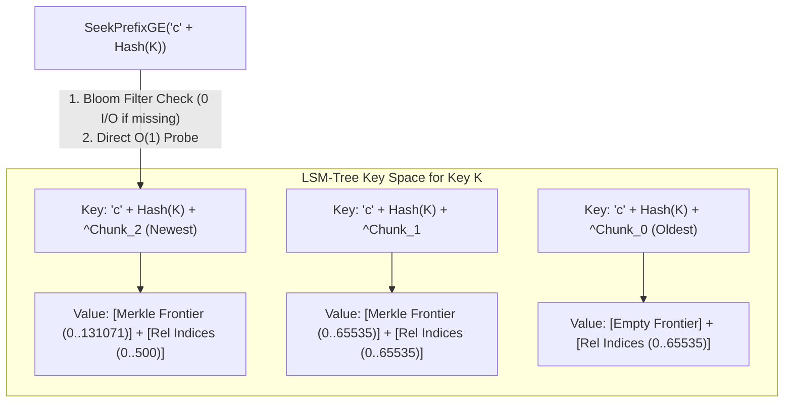

# Design Doc: Inverted Chunk Scan for Pebble VIndex

For empirical benchmark methodology, multi-million entry performance tables, and comparative graphs, see [README.md](README.md).

## Context

### Objective
Provide an efficient, highly scalable, and crash-resilient storage layout for verifiable index logs (VIndex) in Pebble that achieves high-throughput batch appends and fast range queries across billions of keys without write amplification or compaction stalls.

### Background
Verifiable logs and transparent index systems (such as Certificate Transparency and verifiable maps) associate cryptographic identifiers (32-byte key hashes) with a sequence of chronological log entry indices. The storage layer for this index must satisfy three core requirements:
1. **High-Throughput Batch Appends (`WriteBatch`)**: Ingest hundreds of thousands of index updates per second across sparse, highly distributed keys.
2. **Sub-Log Merkle Commitments (`GetSubRoot`)**: Dynamically compute or retrieve the Merkle root hash committing to all occurrences of a given key.
3. **Range Queries (`Lookup`)**: Efficiently fetch index sequence numbers starting from an arbitrary sequence offset K.

Existing naive approaches fail at scale: storing a flat list of indices per key causes O(N^2) write amplification as lists grow, while appending raw log records per entry causes severe read latency, large SSTable metadata overhead, and compaction write stalls in LSM engines.

In production verifiable storage architectures, the underlying Pebble database holds multiple heterogeneous subsystems within the same keyspace:
* **Tree & System Metadata**: Global log tree size commitments, signed tree heads (STHs), checkpoint manifests, and configuration records.
* **Write-Ahead Log (WAL) / Linear Log**: Primary append-only sequential log entries.
* **Verifiable Index (VIndex)**: Key-to-sequence mappings providing verifiable sub-log membership proofs.

To prevent keyspace collisions, ensure clean range scan boundaries, and allow Pebble's prefix-split comparer to operate without interfering with metadata or WAL records, all VIndex chunk keys utilize an explicit 1-byte domain separation prefix (`'c'`). Note that while metadata and WAL structures are integral to full production system designs, they are out of scope for these isolated VIndex storage layout performance benchmarks.

---

## Design

### Overview
`PebbleInvertedPrefixChunkScan` partitions each key's log into fixed-capacity logical chunks (default size 65,536 entries) and addresses the scalability limits of LSM-trees through three coordinated techniques:

1. **Inverted Chunk Numbering (`^chunkNum`)**: Chunk numbers are bitwise-inverted (`math.MaxUint64 - chunkNum`), ordering chunks from newest to oldest in the LSM key space. This ensures the latest active chunk is the very first key under the prefix, allowing a single forward `SeekPrefixGE` probe to find the active chunk in O(1) time without forward scanning.
2. **Prefix Bloom Filtering**: A custom Pebble comparer splits keys at the 33-byte prefix boundary (`'c' + Hash(Key)`), enabling full-table Bloom filters to prune SSTable seeks with zero disk I/O on new/sparse keys during forward prefix seeks.
3. **Self-Contained Uniform Value Schema**: Every chunk stores a cumulative Merkle frontier covering all prior chunks, plus its own local relative indices. Once written, past chunks are immutable and never rewritten or modified when new chunks are created.



### Infrastructure
* **Storage Engine**: [Pebble](https://github.com/cockroachdb/pebble) (Go LSM-tree key-value store).
  * Configured with a custom `pebble.Comparer` (`pebble_tests.inverted_prefix_chunk_comparer`) defining a 33-byte prefix split.
  * Configured with 10-bit block/table Bloom filters (`bloom.FilterPolicy(10)`).
* **Cryptographic Hashing & Merkle Trees**:
  * RFC 6962 tree hashing via [`github.com/transparency-dev/merkle/rfc6962`](https://github.com/transparency-dev/merkle).
  * Compact Merkle tree range representation via [`github.com/transparency-dev/merkle/compact`](https://github.com/transparency-dev/merkle).

### Detailed design

#### 1. Key Encoding & Inverted Chunk Space
Keys are formatted with a 1-byte domain separation prefix, 32-byte key hash, and an 8-byte big-endian bitwise-inverted chunk number:

```
Key = 'c' (1B) + KeyHash (32B) + BigEndian(^chunkNum) (8B)
```
where `^chunkNum = math.MaxUint64 - chunkNum`.

* **Domain Separation Prefix (`'c'`)**: The 1-byte `'c'` prefix isolates VIndex chunk records from metadata keys (checkpoints, configuration) and sequential log entries in multi-subsystem deployments, allowing prefix filters to operate without cross-subsystem interference.
* **Logical Chunk Capacity**: `chunkSize = 65536`. Logical chunk number is computed as `chunkNum = index / chunkSize`.
* **Prefix Comparer**: `Split(key)` returns 33 bytes (`'c' + KeyHash`). Pebble uses this prefix to construct Bloom filters.
* **The LSM-Tree Bloom Filter Constraint & Inversion Rationale**:
  * In LSM-tree engines like Pebble, Bloom filters are constructed on key prefixes and can **only be evaluated during forward prefix seeks (`SeekPrefixGE`)**. They cannot be used for reverse seeks (`SeekLT`), because reverse seeks search for keys strictly less than a target and cannot evaluate set membership.
  * **The Forward Scan Flaw with Ascending Numbers**: If chunk numbers are stored in natural ascending order (`0, 1, 2... N`), the latest active chunk (`N`) is at the tail of the prefix range. Calling `SeekPrefixGE(prefix)` lands on Chunk 0 and forces the engine to scan forward through all older sealed chunks (`0...N`) via `iter.Next()`. On deep/hot keys with many chunks, this linear scan degrades append throughput by up to 7.5x.
  * **How Inverted Chunk Numbers Solve This**: By storing chunk numbers as `^chunkNum = math.MaxUint64 - chunkNum`, the latest active chunk (`N`) is lexicographically the *first* key under the prefix (`^N < ^0`). A single `SeekPrefixGE(prefix)` call evaluates the Bloom filter for zero-I/O skipping on new keys AND lands **directly on the latest active chunk in a single O(1) probe**, completely eliminating forward scanning.

#### 2. Value Schema & Delimitless Deserialization
Every chunk value uses a single uniform binary schema:

```
+-------------------------------------------------------------+------------------------------------+
|                Serialized compact.Range                     |      Relative Indices ([]uint16)   |
+------------------------------+------------------------------+------------------+-----------------+
|   Covered Size (8B uint64)   | Hashes (32B * OnesCount(Size))| relIndex 0 (2B)  | relIndex 1 (2B) |
+------------------------------+------------------------------+------------------+-----------------+
```

1. **Covered Size (N_prior)**: The first 8 bytes represent the total count of elements committed across all preceding chunks (chunks 0 to chunkNum-1). For chunk 0, this value is 0.
2. **Compact Hashes**: Contains `bits.OnesCount64(N_prior)` hashes (32 bytes each).
3. **Relative Indices**: A continuous byte array of 2-byte unsigned integers representing `index % chunkSize`.
4. **Delimitless Parsing**: The parser extracts the exact range boundary in memory via `offset = 8 + 32 * bits.OnesCount64(N_prior)` without requiring extra length prefixes or variable-length delimiters.

#### 3. Write Path (`WriteBatch`)
1. **Key Sorting**: The batch keys are sorted in ascending lexicographical order (`bytes.Compare`).
2. **Shared Iterator Allocation**: A single `pebble.Iterator` is opened before batch processing and reused across all seeks.
3. **O(1) Active Chunk Discovery**:
   * Execute `iter.SeekPrefixGE(prefix)`.
   * **New Key**: The Bloom filter checks the 33-byte prefix. If absent, it immediately returns `false` with **zero disk reads**.
   * **Existing Key**: The iterator lands **directly on the latest active chunk** in O(1) time, regardless of whether 1 or 1,000 historical chunks exist.
   * **Why Seeking the Prior Chunk is Mandatory**: Every chunk N embeds a cumulative Merkle `compact.Range` that commits to all index entries in all preceding chunks (chunks 0 to N-1). Even if an incoming write batch is guaranteed to write exclusively into a brand-new chunk boundary (e.g., transitioning from chunk N to chunk N+1), the engine *must* seek and read the latest existing chunk to retrieve its historical range and fold its relative indices into a finalized frontier. Without this seek, the new chunk cannot construct the cumulative Merkle state committing to the key's full historical log.
4. **Append & Boundary Transition**:
   * Append `index % chunkSize` to `relativeIndices`.
   * If a write crosses a chunk boundary:
     * Write the current chunk to Pebble under `prefix + BigEndian(^currChunkNum)`. (Existing chunk records are immutable and are never modified or rewritten).
     * Finalize the compact range in memory by appending local `relativeIndices` to `startingRange`.
     * Allocate a new chunk with `startingRange = finalizedRange` and `currChunkNum = nextChunkNum`.
5. **Atomic Commit**: Serialize the active chunk, write it to the batch, and commit atomically with `batch.Commit(pebble.Sync)`.

#### 4. Read Path (`Lookup`)
1. **Positioning**: Compute `startChunkNum = start / chunkSize` and seek `iter.SeekGE(prefix + BigEndian(^startChunkNum))`.
2. **Reverse Scan (Chronological Progression)**: Scan backwards using `iter.Prev()` while `bytes.HasPrefix(iter.Key(), prefix)`. Because keys are inverted, `iter.Prev()` traverses chunks in forward chronological order (from `startChunkNum` towards the newest chunk).
3. **Index Reconstruction**: Convert relative offsets back to absolute indices (`chunkNum * chunkSize + relOffset`) and slice from the requested `start` offset.

#### 5. Authenticated Root Query (`GetSubRoot`)
1. Call `iter.SeekPrefixGE(prefix)` to position on the active chunk in 1 seek.
2. Deserialize the chunk, compute leaf hashes for active relative indices, append them to the cached `compact.Range` in memory, and return the computed root.

#### 6. Crash Recovery & Resiliency
Because each chunk stores the cumulative Merkle range committing to all preceding chunks, crash recovery requires **zero back-scanning**. Reading the latest valid chunk from disk immediately restores full Merkle state up to the last committed transaction.

#### 7. Code References
The implementation is located in:
* [`store/inverted_prefix_chunk_scan.go`](file:///usr/local/google/home/mhutchinson/git/pebble-tests/store/inverted_prefix_chunk_scan.go): Primary engine implementation.
* [`store/store.go`](file:///usr/local/google/home/mhutchinson/git/pebble-tests/store/store.go): `IndexStore` interface and `sortedKeys` helper.
* [`store/merkle.go`](file:///usr/local/google/home/mhutchinson/git/pebble-tests/store/merkle.go): Shared serialization and compact range routines.

---

## Alternatives considered

### 1. Flat List per Key (`PebbleFlat`)
* **Mechanism**: Maps `Hash(Key)` to a single byte array containing all historical index sequence numbers `[]uint64`.
* **Pros**: Simplest possible read path (single `db.Get` point lookup).
* **Cons**: Severe O(N^2) write amplification. Appending 1 index to a key with 100,000 existing occurrences requires reading and rewriting all 800 KB on every write. At 20M entries, write throughput collapsed completely. Dropped from production consideration.

### 2. Standard Forward Chunk Scan (`PebbleChunkScan`)
* **Mechanism**: Stores chunks with normal ascending chunk numbers (`chunkNum = 0, 1, 2...`). Uses `iter.SeekLT(upperBound)` to locate the active chunk and forward scans (`iter.Next()`) for `Lookup`.
* **Pros**: Uses standard Pebble options with `pebble.DefaultComparer`; no custom comparer or Bloom filter setup required.
* **Cons**: `SeekLT` reverse seeks **cannot use Bloom filters** in LSM-trees. For high-cardinality sparse datasets (billions of keys), Pebble must perform binary searches across disk-resident SSTable index blocks across all levels for every key in `WriteBatch`. In benchmarks, `inverted_prefix_chunk_scan` was **+48.4% faster** on 1M keys and up to **+60.5% faster** on mixed workloads due to Bloom filter pruning.

### 3. Chunk Sealing & Range Stripping (`PebbleSealingChunkScan`)
* **Mechanism**: When a chunk reaches capacity, an explicit "sealing" write rewrites the closed chunk in Pebble to strip its historical Merkle range, leaving only raw relative indices to conserve disk space.
* **Pros**: Saves storage space by eliminating range hash duplication across sealed chunks.
* **Cons**:
  * **Write Amplification**: Crossing chunk boundaries triggers two Pebble writes (rewriting the sealed chunk + writing the new chunk), degrading write throughput by **15% to 35%**.
  * **Slow Recovery**: If the active chunk is corrupted, recovering historical Merkle roots requires scanning and rehashing from chunk 0 (O(N) recovery cost vs. O(1) in the self-contained layout).
